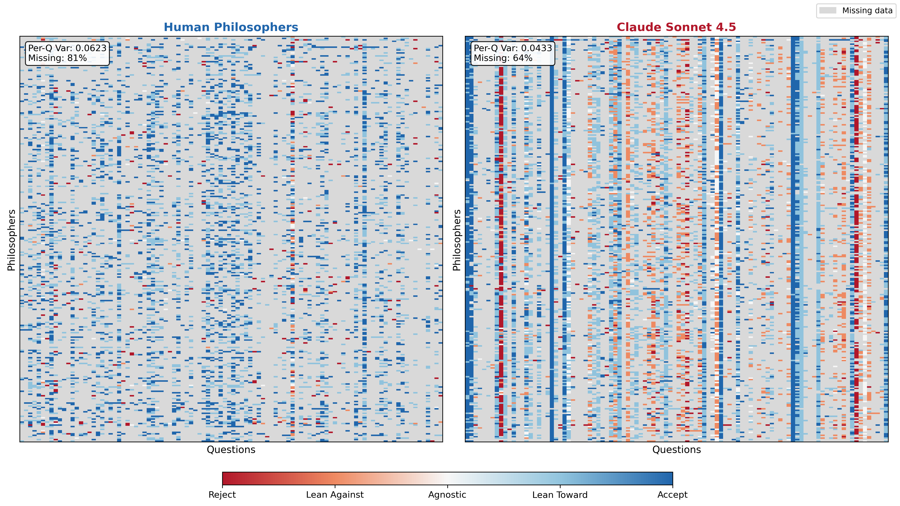
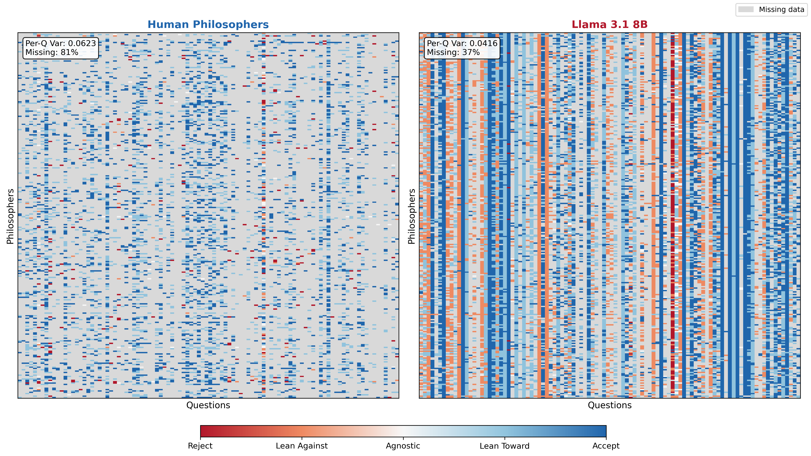

# Figure 4 Correction - Using Actual Paper Figure

## Issue Identified
The website was displaying the **8-panel appendix figure** (showing all 7 LLMs) instead of the actual **Figure 4** from the main paper body.

## Actual Figure 4 from Paper
According to `/Users/jeremyshi/courses/cs329h-f25/project/final_paper_acm.tex` (lines 226-242):

**Figure 4** consists of **two subfigures** side-by-side:
- **(a) Human vs. Claude Sonnet 4.5** - `figure1_human_vs_sonnet.pdf`
- **(b) Human vs. Llama 3.1 8B** - `figure1_human_vs_llama.pdf`

This is labeled as `\label{fig:heterogeneity}` in the paper.

The 8-panel figure showing all 7 models is in the **Appendix** (Section "Heterogeneity Collapse Across All Models", labeled `fig:8panel`).

## Correction Made

### Files Added:
```
assets/figures/figure1_human_vs_sonnet.png (218 KB)
assets/figures/figure1_human_vs_llama.png (221 KB)
```

### HTML Updated:
Changed from single 8-panel image to two-column grid with subfigures:

```html
<div class="figure-grid-2col">
    <div class="subfigure">
        
        <p class="subfigure-caption">(a) Human vs. Claude Sonnet 4.5</p>
    </div>
    <div class="subfigure">
        
        <p class="subfigure-caption">(b) Human vs. Llama 3.1 8B</p>
    </div>
</div>
```

### Caption Updated:
Now uses the **exact caption from paper** (lines 239-240):

> **Figure 4:** Response matrices comparing human philosophers (left panels) and LLM simulations (right panels).
> Rows represent individual philosophers; columns represent specific survey questions. Each row is a philosopher (N=277),
> each column a question (100 questions). Human per-question variance is 0.062; Sonnet 4.5 shows 0.043 (1.4× lower),
> Llama shows 0.042 (1.5× lower). Vertical lines indicate near-uniform responses: Claude shows zero variance on 10 questions
> (e.g., "philosophical knowledge," "cosmological fine-tuning"); Llama on 7 questions (e.g., "statue and lump," "sleeping beauty").
> Humans show lowest variance on "other minds" (var=0.002) but highest on "arguments for theism" (var=0.17). Gray indicates missing data.

### CSS Added:
```css
.figure-grid-2col {
    display: grid;
    grid-template-columns: repeat(2, 1fr);
    gap: 1.5rem;
    margin: 1.5rem 0;
}

.subfigure {
    text-align: center;
}

.result-img-subfigure {
    width: 100%;
    height: auto;
    border: 1px solid var(--border-color);
    border-radius: 0.5rem;
}

.subfigure-caption {
    font-size: 0.9rem;
    color: var(--text-secondary);
    margin-top: 0.5rem;
    font-style: italic;
}
```

### Responsive Design:
On mobile screens, the two-column grid collapses to single column:
```css
@media (max-width: 768px) {
    .figure-grid-2col {
        grid-template-columns: 1fr;
    }
}
```

## Verification

✅ Figure 4 now shows correct 2-panel comparison (Human vs. Sonnet, Human vs. Llama)
✅ Caption matches paper exactly with all variance numbers
✅ Subfigure labels (a) and (b) included
✅ Grid layout responsive (stacks on mobile)
✅ All files present in assets folder

## What Was Wrong vs. What's Right

**WRONG (before):**
- Displayed `figure1_8panel.png` (8 separate panels showing all 7 LLMs + human)
- Caption said "Figure 4 (Appendix)"
- This is actually the appendix figure, not the main Figure 4

**RIGHT (now):**
- Displays two-panel comparison: Human vs. Sonnet and Human vs. Llama
- Caption says "Figure 4" (no appendix notation)
- Matches the actual Figure 4 from the paper body (lines 226-242)
- Uses exact caption text from the LaTeX source

---

**Status: ✅ Corrected**

Figure 4 now accurately represents the paper's main heterogeneity collapse visualization.
