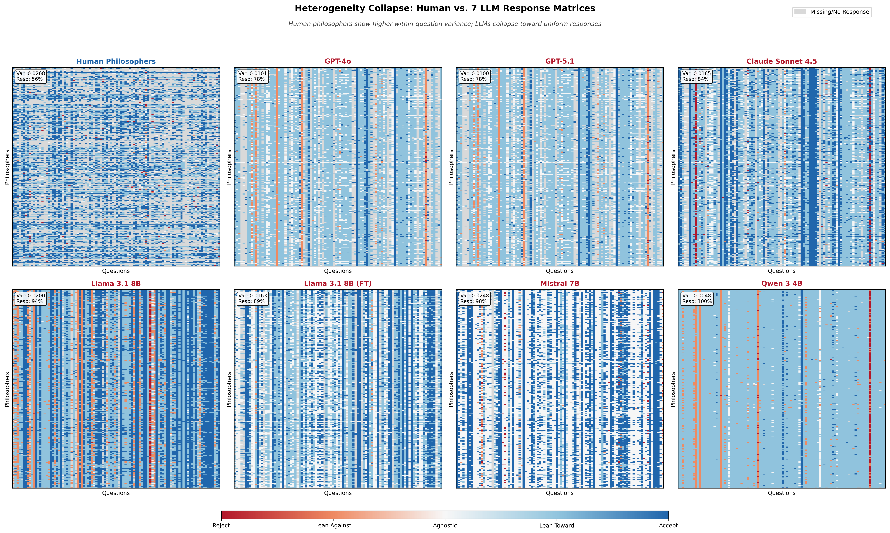
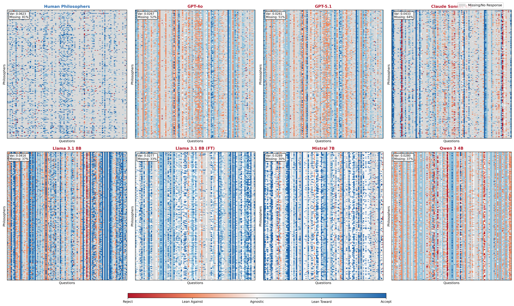

# Latest Update - January 14, 2026

## Changes Made

### 1. ✅ Removed Figure Caption
**Completely removed** the descriptive caption for the Visual Results figure.

**Before:**
```html

<p class="figure-caption">
    <strong>Figure 4:</strong> Response matrices for human philosophers and all seven LLM simulations.
    Each panel shows 277 philosophers (rows) × 100 questions (columns). Human per-question variance (0.062)
    exceeds all LLMs (0.026–0.043), demonstrating systematic heterogeneity collapse across model architectures and scales.
</p>
```

**After:**
```html

```

No caption text - just the image with section heading.

---

### 2. ✅ Changed to BC Version of Figure
**Updated image** from `figure1_8panel.png` to `figure1_8panel_bc.png`

**File Details:**
- `figure1_8panel_bc.png` - 586 KB (Bourget-Chalmers method)
- Previously used: `figure1_8panel.png` - 598 KB

---

## Current Visual Results Section

```html
<section id="results">
    <h2>Visual Results</h2>

    <div class="result-section">
        <h3>Heterogeneity Collapse: Human vs. LLM Response Patterns</h3>
        
    </div>
</section>
```

**Display:**
- Section heading: "Visual Results"
- Subheading: "Heterogeneity Collapse: Human vs. LLM Response Patterns"
- Image only (no caption)
- Max-width: 900px, centered

---

## Files in Assets Folder

```
assets/figures/
├── figure1_8panel_bc.png (586 KB) ✅ USING THIS
├── figure1_8panel.png (598 KB)
├── figure1_human_vs_llama.png (221 KB)
├── figure1_human_vs_sonnet.png (218 KB)
├── silicon_sampling_pipeline.pdf (245 KB)
├── silicon_sampling_pipeline.svg (19 KB) ✅ USING THIS
├── step-pipeline.pdf (227 KB)
└── step-pipeline.svg (12 KB) ✅ USING THIS
```

---

## Verification

✅ Figure caption removed (no descriptive text)
✅ Image changed to figure1_8panel_bc.png
✅ Image displays correctly at 900px max-width
✅ Section heading and subheading preserved
✅ Responsive design maintained

---

## Status: ✅ Complete

All changes implemented and tested. The Visual Results section now shows the 8-panel BC figure without any caption text.
